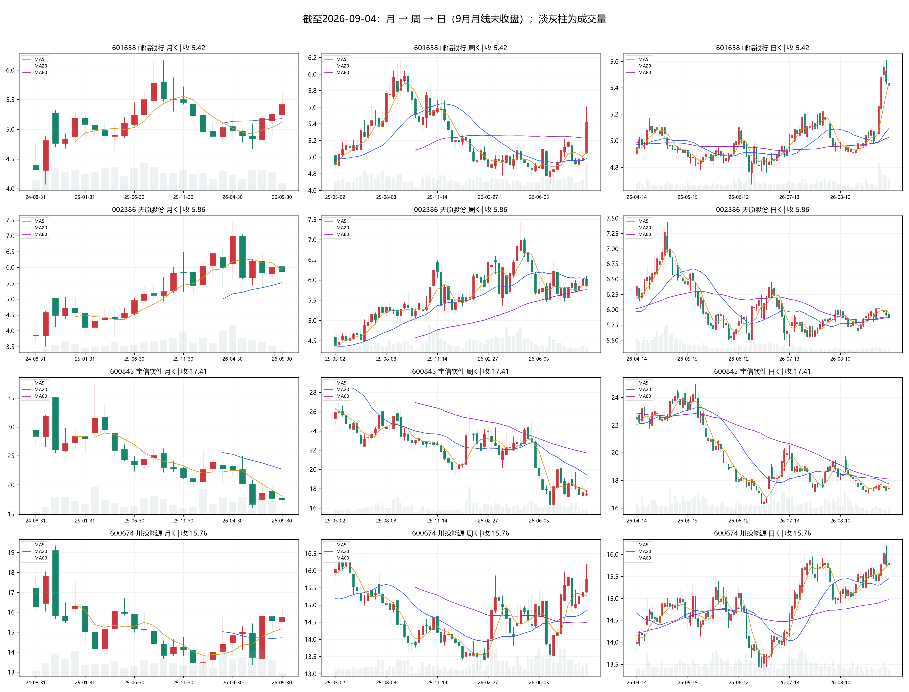
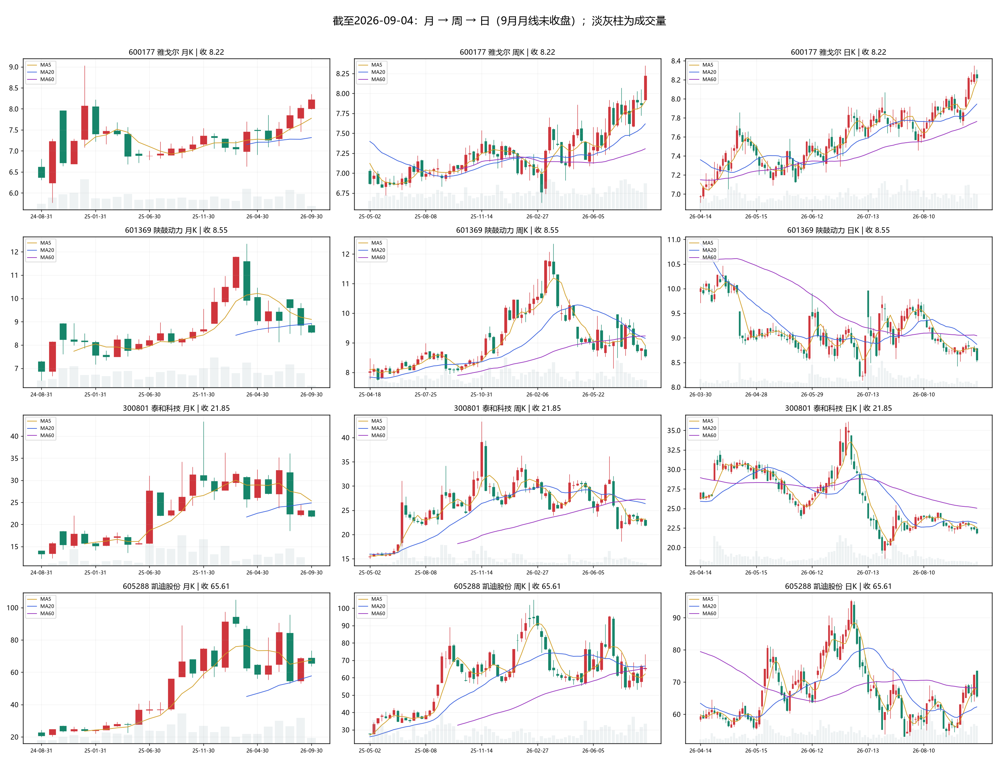
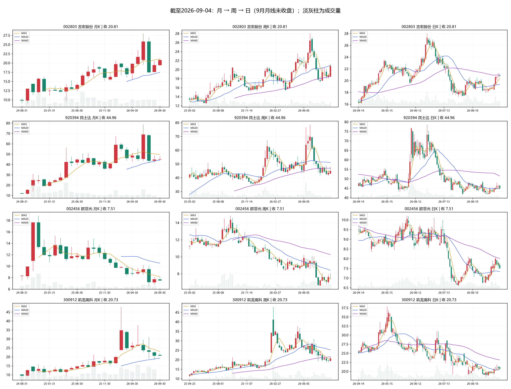
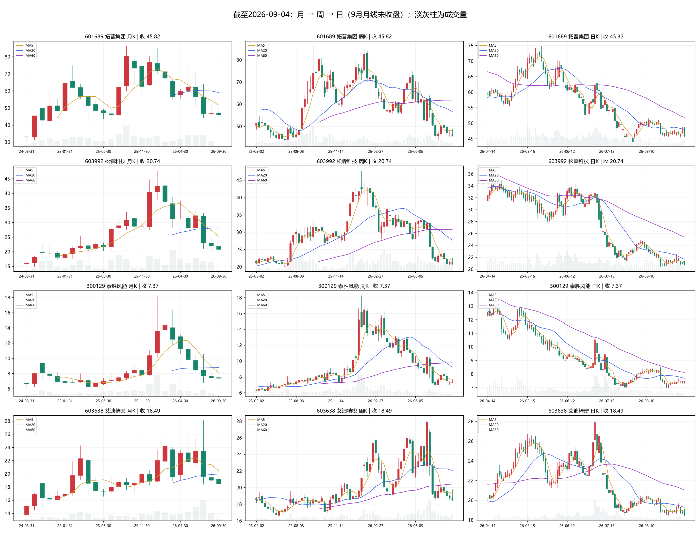
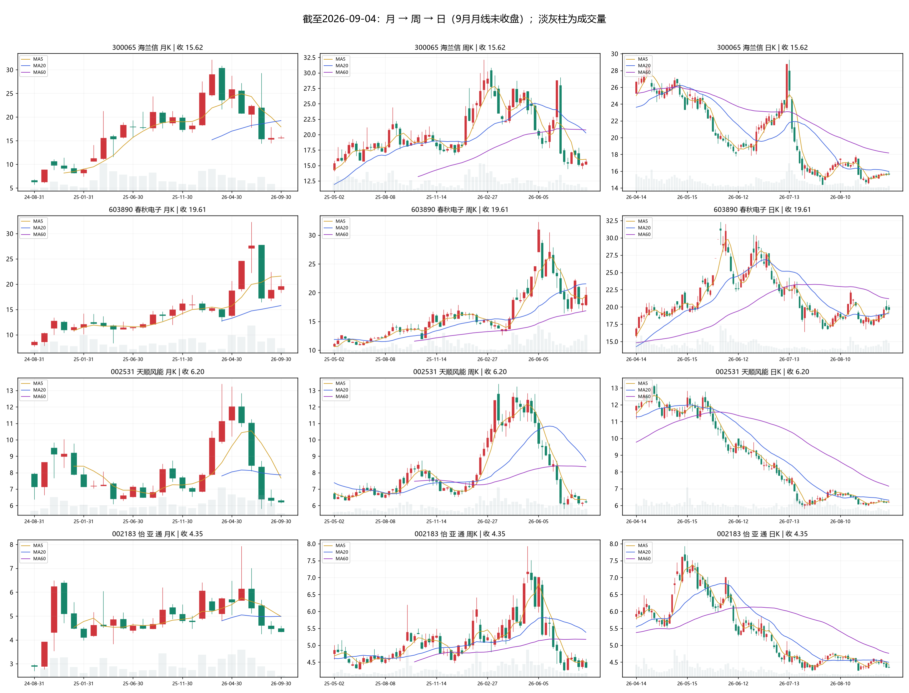

# 本地A股纯技术面形态分析

分析基准：2026-09-04收盘；生成日期：2026-09-06。价格为本地前复权口径。

本组更值得观察的是雅戈尔的趋势延续、邮储银行的放量突破修复，以及川投能源回箱后能否重新突破。13只W底标签主要代表右底候选，不能统一称作上涨趋势。以下排序是对程序返回20只的人工复核顺序，不是全市场纯技术得分前20名。

## 数据与方法

- 状态接口报告5732只具备至少260根K线，覆盖率97%，full_market_ready=true。但该字段统计历史长度，不要求每只更新至最新交易日；最新日期覆盖约5548只，低于全量名单95%。本报告不作完整市场结论。
- 原筛选接口返回 universe_size=5587、scanned=5732、skipped=0，分母与扫描统计口径不一致；保留原值，但不把5732当作实际成功检测数量。原始输出见candidates.json。
- 使用 top_n=20、lookback_days=20、strict=true。代码实际回看40个自然日（8月28日前的信号也可能入选），strict阈值是预设规则，不代表已经得到本次样本外验证。
- 所有20只证据包均为500根日K，最新日为9月4日；通常起始于2024-08-14，部分起始于2024-07-31。月周日图已逐只查看。月线只有约26根，缺少月MA60；9月月线尚未结束，重采样标签2026-09-30不代表数据来自未来。
- 原评分含板块涨跌加分。表内同时保留原分和扣除板块分后的值，仅作可追溯参考；候选池仍受到原评分选择影响。人工结论仅使用K线、均线、成交量及结构位，不用基本面、新闻、资金流或人气。
- 行情快照与排名标记为8月29日，未参与判断。筛选信号日期与最新价格不同，必须重新判定保持、回箱或失守。
- 信号量比为信号日成交量/含当日在内的5日均量；另计算近5日均量/近20日均量，以及最新日成交量/此前20日均量，三者不能混用。

## 当前样本的上涨特点

1. 顺趋势的共性更集中在均线与结构同时改善。雅戈尔和川投能源均为MA20>MA60>MA120>MA250，且MA20、MA60近5日上升；但川投回到箱顶下方，说明均线多头仍需与最新突破状态一起判断。
2. 突破必须检查后续保持。雅戈尔收8.22，高于8.02箱顶；邮储银行收5.42，高于5.22箱顶。川投收15.76，低于15.86箱顶，不能继续沿用confirmed标签。
3. 上涨阶段需要价格脱离压力与成交量配合。邮储近5/20日均量2.00倍、雅戈尔1.26倍；这描述当前样本，不是经过回测确定的最优阈值。反弹缩量既可能是抛压减轻，也可能是需求不足，需看是否突破。
4. 右底抬高是初步改善，颈线与中期均线才是后续检验。吉宏右底18.00高于17.23左底，已小幅越过20.56颈线，但20.94附近MA60仍构成阻力。其他大部分W底仍未越颈线。
5. 乖离影响追高风险。邮储距MA20约6.47%，吉宏约7.39%，雅戈尔约3.46%；这些是位置描述，不是买卖阈值。不能仅按原始形态得分排序。

## 20只比较

|复核顺序|股票|最新收盘|最新判读|原分/扣板块分|距MA20|5/20日均量|
|---|---|---:|---|---:|---:|---:|
|1|雅戈尔 600177|8.22|趋势延续／突破保持|70.18/60.18|+3.46%|1.26|
|2|邮储银行 601658|5.42|突破后整理|77.50/67.50|+6.47%|2.00|
|3|川投能源 600674|15.76|趋势上行／突破回箱|71.22/61.22|+2.03%|1.02|
|4|吉宏股份 002803|20.81|右底反弹／刚越颈线|47.86/37.86|+7.39%|1.19|
|5|凯迪股份 605288|65.61|宽幅筑底／冲颈线回落|48.60/42.60|+5.35%|1.06|
|6|天原股份 002386|5.86|中期整理／均线黏合|74.11/64.11|-0.20%|1.04|
|7|春秋电子 603890|19.61|右底反弹|41.62/41.62|+3.04%|1.30|
|8|民士达 920394|44.96|低位筑底|46.84/42.84|+0.69%|1.04|
|9|欧菲光 002456|7.51|下跌后的右底反弹|46.08/38.08|+2.37%|1.03|
|10|凯龙高科 300912|20.73|下降趋势中的弱反弹|44.44/40.44|+1.20%|0.82|
|11|宝信软件 600845|17.41|弱势横盘|71.87/61.87|-2.00%|0.69|
|12|海兰信 300065|15.62|低位整理／反弹乏力|42.14/32.14|-2.16%|0.70|
|13|泰胜风能 300129|7.37|弱势二次探底后整理|42.85/34.85|-3.95%|0.75|
|14|天顺风能 002531|6.20|跌后横盘|41.56/35.56|-1.84%|0.97|
|15|怡 亚 通 002183|4.35|弱势箱内整理|41.41/31.41|-3.26%|1.06|
|16|拓普集团 601689|45.82|右底承压|44.11/34.11|-4.41%|1.04|
|17|松霖科技 603992|20.74|右底附近弱整理|43.23/37.23|-4.17%|1.03|
|18|艾迪精密 603638|18.49|右底承压|42.57/36.57|-4.03%|1.20|
|19|陕鼓动力 601369|8.55|颈线失守／弱势整理|55.78/47.78|-3.59%|0.89|
|20|泰和科技 300801|21.85|颈线失守／弱势延续|54.89/50.89|-5.43%|0.67|

## 逐股证据卡

### 雅戈尔（600177）

**结论：趋势延续／突破保持。** 月线整理后抬升，周线高低点与均线逐步向上，日线突破后保持箱体上方。当前20/60/120/250日均线依次排列，是本组最清楚的顺趋势案例。

- 数据：前复权；2024-08-14至2026-09-04，500根；截至基准日不陈旧。
- 程序信号：box_breakout / box_breakout，2026-09-01；原阶段confirmed；图数复核：基本一致。对‘趋势阶段’判断把握中等，未来涨跌概率未校准。
- 日均线：MA20=7.945；MA60=7.763；MA120=7.553；MA250=7.337。
- 均线变化：MA20近5日+1.68%，MA60近5日+0.85%；20日区间收益+7.87%。
- 月线数值：MA5=7.776；MA10=7.527；MA20=7.317。程序二元趋势标签up，具体结构以本卡文字与图形为准。
- 周线数值：MA5=7.902；MA10=7.842；MA20=7.618；MA60=7.306。程序二元趋势标签up，具体结构以本卡文字与图形为准。
- 平台：2026-07-07至2026-08-31，下沿7.57、上沿8.02；信号日期2026-09-01；最新收盘保持箱顶上方。
- 已确认结构点：前高(2026-08-03)=7.920；前低(2026-08-06)=7.460。近端尚未右确认的新高低点不能替代这些历史点。
- 最近已确认低点后的反弹：2026-08-06 7.46 → 2026-09-03 8.35，幅度11.93%；最新价格回吐该段升幅14.61%。这是区间计算，终点未必是已确认波峰，也不是确定的主升浪。
- Fibonacci参考：回调位382=7.637；回调位500=7.445；回调位618=7.253；回调位786=6.979。引擎按其选取波段生成，只作辅助；不把单一比例接近价格当作独立上涨证据。
- 量价：信号日/当时5日均量1.53倍；近5日/20日均量1.26倍；最新日/此前20日均量1.06倍。距MA20 +3.46%，距MA60 +5.89%。
- 未来5—20交易日观察与失效条件：8.02及MA20附近能否获得承接；上方8.35是最近高点，跌回8.02下方会削弱突破，不能将未发生的回踩称为确认。
- 板块资金流、人气：不纳入纯技术结论；相关快照时效不足，未据此加分。
- [数值证据](600177_evidence.json)；[日线数据](600177_ohlcv.csv)。

### 邮储银行（601658）

**结论：突破后整理。** 月线从中期调整中回升；周线大阳线收复长均线，但周MA20仍低于周MA60。日线突破显著，随后从5.61回落，尚处突破后的消化阶段。

- 数据：前复权；2024-08-14至2026-09-04，500根；截至基准日不陈旧。
- 程序信号：box_breakout / box_breakout，2026-08-31；原阶段confirmed；图数复核：部分一致。对‘趋势阶段’判断把握中等，未来涨跌概率未校准。
- 日均线：MA20=5.091；MA60=5.024；MA120=4.990；MA250=5.195。
- 均线变化：MA20近5日+2.13%，MA60近5日+0.85%；20日区间收益+9.27%。
- 月线数值：MA5=5.118；MA10=5.066；MA20=5.178。程序二元趋势标签up，具体结构以本卡文字与图形为准。
- 周线数值：MA5=5.054；MA10=5.045；MA20=4.981；MA60=5.230。程序二元趋势标签down，具体结构以本卡文字与图形为准。
- 平台：2026-07-06至2026-08-28，下沿4.89、上沿5.22；信号日期2026-08-31；最新收盘保持箱顶上方。
- 已确认结构点：前高(2026-07-21)=5.220；前低(2026-08-17)=4.900。近端尚未右确认的新高低点不能替代这些历史点。
- 最近已确认低点后的反弹：2026-08-17 4.90 → 2026-09-03 5.61，幅度14.49%；最新价格回吐该段升幅26.76%。这是区间计算，终点未必是已确认波峰，也不是确定的主升浪。
- Fibonacci参考：反弹位500=5.420；反弹位382=5.243；反弹位618=5.597。引擎按其选取波段生成，只作辅助；不把单一比例接近价格当作独立上涨证据。
- 量价：信号日/当时5日均量2.63倍；近5日/20日均量2.00倍；最新日/此前20日均量1.36倍。距MA20 +6.47%，距MA60 +7.88%。
- 未来5—20交易日观察与失效条件：5.22是箱顶，5.23附近为MA10；保持该区间并再次挑战5.60—5.61才支持延续。短期离MA20较远，不能将高成交量直接解释为低风险。
- 板块资金流、人气：不纳入纯技术结论；相关快照时效不足，未据此加分。
- [数值证据](601658_evidence.json)；[日线数据](601658_ohlcv.csv)。

### 川投能源（600674）

**结论：趋势上行／突破回箱。** 月线修复、周线向上，日线均线多头。但现价15.76低于箱顶15.86，9月2日突破尚未保持，当前是回箱后的观察阶段。

- 数据：前复权；2024-08-14至2026-09-04，500根；截至基准日不陈旧。
- 程序信号：box_breakout / box_breakout，2026-09-02；原阶段confirmed；图数复核：与“已确认突破”冲突。对‘趋势阶段’判断把握中等，未来涨跌概率未校准。
- 日均线：MA20=15.447；MA60=14.969；MA120=14.828；MA250=14.443。
- 均线变化：MA20近5日+0.93%，MA60近5日+0.60%；20日区间收益+5.28%。
- 月线数值：MA5=15.176；MA10=14.611；MA20=14.718。程序二元趋势标签up，具体结构以本卡文字与图形为准。
- 周线数值：MA5=15.280；MA10=15.146；MA20=14.837；MA60=14.484。程序二元趋势标签up，具体结构以本卡文字与图形为准。
- 平台：2026-07-08至2026-09-01，下沿14.03、上沿15.86；信号日期2026-09-02；最新收盘已经回箱。
- 已确认结构点：前高(2026-07-21)=15.980；前低(2026-08-07)=14.810。近端尚未右确认的新高低点不能替代这些历史点。
- 最近已确认低点后的反弹：2026-08-07 14.81 → 2026-09-03 16.20，幅度9.39%；最新价格回吐该段升幅31.65%。这是区间计算，终点未必是已确认波峰，也不是确定的主升浪。
- Fibonacci参考：回调位382=14.915；回调位500=14.570；回调位618=14.225；回调位786=13.735。引擎按其选取波段生成，只作辅助；不把单一比例接近价格当作独立上涨证据。
- 量价：信号日/当时5日均量1.60倍；近5日/20日均量1.02倍；最新日/此前20日均量0.65倍。距MA20 +2.03%，距MA60 +5.28%。
- 未来5—20交易日观察与失效条件：先重新站稳15.86—15.98，再看16.20；MA20约15.45是近端参考，14.81是已确认结构低点。失守箱顶与失守整个上涨结构是不同层次。
- 板块资金流、人气：不纳入纯技术结论；相关快照时效不足，未据此加分。
- [数值证据](600674_evidence.json)；[日线数据](600674_ohlcv.csv)。

### 吉宏股份（002803）

**结论：右底反弹／刚越颈线。** 月线长期上升后的急跌修复，周线尚未重新顺畅上行。最新收盘已略越20.56颈线，但仍低于MA60约20.94；右底18.00高于左底17.23。

- 数据：前复权；2024-08-14至2026-09-04，500根；截至基准日不陈旧。
- 程序信号：w_bottom / right_bottom，2026-08-31；原阶段candidate；图数复核：部分一致，原候选状态滞后。对‘趋势阶段’判断把握中等，未来涨跌概率未校准。
- 日均线：MA20=19.378；MA60=20.944；MA120=20.149；MA250=18.801。
- 均线变化：MA20近5日+1.07%，MA60近5日-0.04%；20日区间收益+6.83%。
- 月线数值：MA5=21.044；MA10=19.680；MA20=17.447。程序二元趋势标签up，具体结构以本卡文字与图形为准。
- 周线数值：MA5=19.412；MA10=19.944；MA20=20.925；MA60=18.478。程序二元趋势标签down，具体结构以本卡文字与图形为准。
- W底：左底2026-07-27 17.23；右底2026-08-21 18.00；右底相对左底+4.47%；颈线20.56。最新收盘高于颈线。
- 右底后收盘越颈线记录：2026-09-01、2026-09-02、2026-09-03、2026-09-04；是否保持以最新收盘判断。
- 已确认结构点：前高(2026-08-06)=20.560；前低(2026-08-21)=18.000。近端尚未右确认的新高低点不能替代这些历史点。
- 最近已确认低点后的反弹：2026-08-21 18.00 → 2026-09-03 21.26，幅度18.11%；最新价格回吐该段升幅13.80%。这是区间计算，终点未必是已确认波峰，也不是确定的主升浪。
- Fibonacci参考：回调位618=20.083；回调位500=21.595；回调位382=23.107；回调位786=17.931。引擎按其选取波段生成，只作辅助；不把单一比例接近价格当作独立上涨证据。
- 量价：信号日/当时5日均量1.39倍；近5日/20日均量1.19倍；最新日/此前20日均量1.09倍。距MA20 +7.39%，距MA60 -0.64%。
- 未来5—20交易日观察与失效条件：观察20.56能否守住及20.94—21.26能否突破；离MA20约7.39%，刚越颈线不等于低位。跌破18.00削弱右底抬高结构。
- 板块资金流、人气：不纳入纯技术结论；相关快照时效不足，未据此加分。
- [数值证据](002803_evidence.json)；[日线数据](002803_ohlcv.csv)。

### 凯迪股份（605288）

**结论：宽幅筑底／冲颈线回落。** 两底几乎等高，月线仍在大幅波动，周线并未恢复上升。日线近期一度冲过颈线68.98，最新收盘已退回其下，不属于稳固的W底突破。

- 数据：前复权；2024-08-14至2026-09-04，500根；截至基准日不陈旧。
- 程序信号：w_bottom / right_bottom，2026-08-27；原阶段candidate；图数复核：部分一致。对‘趋势阶段’判断把握中等，未来涨跌概率未校准。
- 日均线：MA20=62.281；MA60=68.226；MA120=66.196；MA250=69.141。
- 均线变化：MA20近5日+3.60%，MA60近5日-0.19%；20日区间收益+12.31%。
- 月线数值：MA5=67.582；MA10=70.462；MA20=57.730。程序二元趋势标签up，具体结构以本卡文字与图形为准。
- 周线数值：MA5=62.170；MA10=66.394；MA20=66.674；MA60=65.565。程序二元趋势标签down，具体结构以本卡文字与图形为准。
- W底：左底2026-07-30 53.03；右底2026-08-20 53.00；右底相对左底-0.06%；颈线68.98。最新收盘低于颈线。
- 右底后收盘越颈线记录：2026-09-03；是否保持以最新收盘判断。
- 已确认结构点：前高(2026-08-12)=68.980；前低(2026-08-20)=53.000。近端尚未右确认的新高低点不能替代这些历史点。
- 最近已确认低点后的反弹：2026-08-20 53.00 → 2026-09-04 73.54，幅度38.75%；最新价格回吐该段升幅38.61%。这是区间计算，终点未必是已确认波峰，也不是确定的主升浪。
- Fibonacci参考：反弹位382=72.833；反弹位500=78.960；反弹位618=85.087。引擎按其选取波段生成，只作辅助；不把单一比例接近价格当作独立上涨证据。
- 量价：信号日/当时5日均量1.61倍；近5日/20日均量1.06倍；最新日/此前20日均量1.25倍。距MA20 +5.35%，距MA60 -3.83%。
- 未来5—20交易日观察与失效条件：68.23—68.98是MA60与颈线压力区，上方还有73.54；53.00是右底但距离较远，不能把它当成短线低风险支撑。
- 板块资金流、人气：不纳入纯技术结论；相关快照时效不足，未据此加分。
- [数值证据](605288_evidence.json)；[日线数据](605288_ohlcv.csv)。

### 天原股份（002386）

**结论：中期整理／均线黏合。** 月线上涨后的整理，周线横向修复，日线价格贴近MA20和MA60，尚无明确上攻。历史颈线5.40仍在下方，但不能因此判断新一轮上涨已开始。

- 数据：前复权；2024-08-14至2026-09-04，500根；截至基准日不陈旧。
- 程序信号：neckline_reclaim / neckline_hold，2026-08-24；原阶段retesting；图数复核：部分一致。对‘趋势阶段’判断把握中等，未来涨跌概率未校准。
- 日均线：MA20=5.872；MA60=5.867；MA120=6.022；MA250=5.830。
- 均线变化：MA20近5日+0.35%，MA60近5日+0.46%；20日区间收益-1.01%。
- 月线数值：MA5=5.914；MA10=6.047；MA20=5.513。程序二元趋势标签up，具体结构以本卡文字与图形为准。
- 周线数值：MA5=5.878；MA10=5.842；MA20=6.014；MA60=5.759。程序二元趋势标签down，具体结构以本卡文字与图形为准。
- 历史颈线5.40；最新收盘在其上方；保持线附近不自动代表反转。
- 已确认结构点：前高(2026-08-07)=6.060；前低(2026-08-19)=5.640。近端尚未右确认的新高低点不能替代这些历史点。
- 最近已确认低点后的反弹：2026-08-19 5.64 → 2026-09-01 6.10，幅度8.16%；最新价格回吐该段升幅52.17%。这是区间计算，终点未必是已确认波峰，也不是确定的主升浪。
- Fibonacci参考：回调位618=5.883；回调位500=6.180；回调位786=5.459；回调位382=6.477。引擎按其选取波段生成，只作辅助；不把单一比例接近价格当作独立上涨证据。
- 量价：信号日/当时5日均量1.07倍；近5日/20日均量1.04倍；最新日/此前20日均量0.95倍。距MA20 -0.20%，距MA60 -0.11%。
- 未来5—20交易日观察与失效条件：近支撑5.64，压力6.02—6.10；需要价格脱离均线黏合区并改善成交量。
- 板块资金流、人气：不纳入纯技术结论；相关快照时效不足，未据此加分。
- [数值证据](002386_evidence.json)；[日线数据](002386_ohlcv.csv)。

### 春秋电子（603890）

**结论：右底反弹。** 月线经历急涨急跌，周线仍在修复；日线站回MA20且近期量能增加，但MA60明显下行，距离22.42颈线仍远。

- 数据：前复权；2024-08-14至2026-09-04，500根；截至基准日不陈旧。
- 程序信号：w_bottom / right_bottom，2026-09-02；原阶段candidate；图数复核：候选形态一致，上涨未确认。对‘趋势阶段’判断把握中等，未来涨跌概率未校准。
- 日均线：MA20=19.032；MA60=21.197；MA120=20.241；MA250=17.446。
- 均线变化：MA20近5日+1.59%，MA60近5日-2.59%；20日区间收益+2.51%。
- 月线数值：MA5=21.590；MA10=18.641；MA20=15.771。程序二元趋势标签up，具体结构以本卡文字与图形为准。
- 周线数值：MA5=19.412；MA10=19.943；MA20=21.541；MA60=16.852。程序二元趋势标签down，具体结构以本卡文字与图形为准。
- W底：左底2026-07-21 16.42；右底2026-08-24 16.80；右底相对左底+2.31%；颈线22.42。最新收盘低于颈线。
- 右底后收盘越颈线记录：无；尚无突破量能可确认。
- 已确认结构点：前高(2026-08-14)=22.420；前低(2026-08-24)=16.800。近端尚未右确认的新高低点不能替代这些历史点。
- 最近已确认低点后的反弹：2026-08-24 16.80 → 2026-09-03 20.99，幅度24.94%；最新价格回吐该段升幅32.94%。这是区间计算，终点未必是已确认波峰，也不是确定的主升浪。
- Fibonacci参考：回调位618=19.719；回调位500=22.125；回调位786=16.293；回调位382=24.531。引擎按其选取波段生成，只作辅助；不把单一比例接近价格当作独立上涨证据。
- 量价：信号日/当时5日均量1.48倍；近5日/20日均量1.30倍；最新日/此前20日均量1.35倍。距MA20 +3.04%，距MA60 -7.49%。
- 未来5—20交易日观察与失效条件：先看19.72附近与MA60约21.20，再看22.42；16.80为右底。
- 板块资金流、人气：不纳入纯技术结论；相关快照时效不足，未据此加分。
- [数值证据](603890_evidence.json)；[日线数据](603890_ohlcv.csv)。

### 民士达（920394）

**结论：低位筑底。** 两底接近，日线仅回到MA20附近，MA60继续下行；月线位于长期均线附近不代表近期趋势向上，周线仍弱。

- 数据：前复权；2024-08-14至2026-09-04，500根；截至基准日不陈旧。
- 程序信号：w_bottom / right_bottom，2026-09-02；原阶段candidate；图数复核：候选形态一致，上涨未确认。对‘趋势阶段’判断把握中等，未来涨跌概率未校准。
- 日均线：MA20=44.651；MA60=51.457；MA120=50.234；MA250=47.381。
- 均线变化：MA20近5日-0.58%，MA60近5日-2.80%；20日区间收益-4.71%。
- 月线数值：MA5=49.570；MA10=49.769；MA20=44.220。程序二元趋势标签up，具体结构以本卡文字与图形为准。
- 周线数值：MA5=44.634；MA10=47.774；MA20=50.957；MA60=46.903。程序二元趋势标签down，具体结构以本卡文字与图形为准。
- W底：左底2026-07-30 41.67；右底2026-08-24 41.70；右底相对左底+0.07%；颈线48.87。最新收盘低于颈线。
- 右底后收盘越颈线记录：无；尚无突破量能可确认。
- 已确认结构点：前低(2026-08-24)=41.700；前高(2026-08-19)=48.870。近端尚未右确认的新高低点不能替代这些历史点。
- 最近已确认低点后的反弹：2026-08-24 41.70 → 2026-09-02 47.95，幅度14.99%；最新价格回吐该段升幅47.84%。这是区间计算，终点未必是已确认波峰，也不是确定的主升浪。
- Fibonacci参考：回调位786=44.260；回调位618=51.600；回调位500=56.755；回调位382=61.910。引擎按其选取波段生成，只作辅助；不把单一比例接近价格当作独立上涨证据。
- 量价：信号日/当时5日均量1.64倍；近5日/20日均量1.04倍；最新日/此前20日均量0.97倍。距MA20 +0.69%，距MA60 -12.63%。
- 未来5—20交易日观察与失效条件：48.87颈线和51.46附近MA60是两道压力；41.70右底需保持。
- 板块资金流、人气：不纳入纯技术结论；相关快照时效不足，未据此加分。
- [数值证据](920394_evidence.json)；[日线数据](920394_ohlcv.csv)。

### 欧菲光（002456）

**结论：下跌后的右底反弹。** 月周线下行清楚，日线从第二个低点反弹后在MA60下方遇阻。MA20近乎走平，可说明跌势缓和，不能说明趋势反转。

- 数据：前复权；2024-07-31至2026-09-04，500根；截至基准日不陈旧。
- 程序信号：w_bottom / right_bottom，2026-08-27；原阶段candidate；图数复核：候选形态一致，上涨未确认。对‘趋势阶段’判断把握中等，未来涨跌概率未校准。
- 日均线：MA20=7.336；MA60=8.012；MA120=8.548；MA250=10.053。
- 均线变化：MA20近5日+0.01%，MA60近5日-1.58%；20日区间收益-1.44%。
- 月线数值：MA5=8.172；MA10=8.842；MA20=10.522。程序二元趋势标签down，具体结构以本卡文字与图形为准。
- 周线数值：MA5=7.420；MA10=7.730；MA20=8.402；MA60=10.259。程序二元趋势标签down，具体结构以本卡文字与图形为准。
- W底：左底2026-07-27 6.61；右底2026-08-19 6.73；右底相对左底+1.82%；颈线8.10。最新收盘低于颈线。
- 右底后收盘越颈线记录：无；尚无突破量能可确认。
- 已确认结构点：前高(2026-08-05)=8.100；前低(2026-08-19)=6.730。近端尚未右确认的新高低点不能替代这些历史点。
- 最近已确认低点后的反弹：2026-08-19 6.73 → 2026-09-01 8.07，幅度19.91%；最新价格回吐该段升幅41.79%。这是区间计算，终点未必是已确认波峰，也不是确定的主升浪。
- Fibonacci参考：反弹位382=9.754；反弹位500=10.725；反弹位618=11.696。引擎按其选取波段生成，只作辅助；不把单一比例接近价格当作独立上涨证据。
- 量价：信号日/当时5日均量1.81倍；近5日/20日均量1.03倍；最新日/此前20日均量0.73倍。距MA20 +2.37%，距MA60 -6.27%。
- 未来5—20交易日观察与失效条件：8.01—8.10是MA60与颈线叠合区；6.73右底是结构参考，量能需在上攻时改善。
- 板块资金流、人气：不纳入纯技术结论；相关快照时效不足，未据此加分。
- [数值证据](002456_evidence.json)；[日线数据](002456_ohlcv.csv)。

### 凯龙高科（300912）

**结论：下降趋势中的弱反弹。** 右底低于左底，月线从高位回落、周线仍受均线压制；日线小幅站回MA20，但5日量低于20日量。

- 数据：前复权；2024-07-31至2026-09-04，500根；截至基准日不陈旧。
- 程序信号：w_bottom / right_bottom，2026-08-31；原阶段candidate；图数复核：候选形态一致，上涨未确认。对‘趋势阶段’判断把握中等，未来涨跌概率未校准。
- 日均线：MA20=20.485；MA60=23.154；MA120=25.225；MA250=22.249。
- 均线变化：MA20近5日-0.21%，MA60近5日-1.88%；20日区间收益+3.29%。
- 月线数值：MA5=22.964；MA10=23.716；MA20=19.255。程序二元趋势标签up，具体结构以本卡文字与图形为准。
- 周线数值：MA5=20.168；MA10=22.410；MA20=25.198；MA60=21.556。程序二元趋势标签down，具体结构以本卡文字与图形为准。
- W底：左底2026-07-21 19.21；右底2026-08-21 18.55；右底相对左底-3.44%；颈线24.93。最新收盘低于颈线。
- 右底后收盘越颈线记录：无；尚无突破量能可确认。
- 已确认结构点：前低(2026-08-21)=18.550；前高(2026-07-31)=24.930。近端尚未右确认的新高低点不能替代这些历史点。
- 最近已确认低点后的反弹：2026-08-21 18.55 → 2026-09-02 21.94，幅度18.27%；最新价格回吐该段升幅35.69%。这是区间计算，终点未必是已确认波峰，也不是确定的主升浪。
- Fibonacci参考：回调位786=21.441；回调位618=27.118；回调位500=31.105；回调位382=35.092。引擎按其选取波段生成，只作辅助；不把单一比例接近价格当作独立上涨证据。
- 量价：信号日/当时5日均量1.45倍；近5日/20日均量0.82倍；最新日/此前20日均量0.61倍。距MA20 +1.20%，距MA60 -10.47%。
- 未来5—20交易日观察与失效条件：先看22.37及23.15附近，再看24.93颈线；18.55是右底。
- 板块资金流、人气：不纳入纯技术结论；相关快照时效不足，未据此加分。
- [数值证据](300912_evidence.json)；[日线数据](300912_ohlcv.csv)。

### 宝信软件（600845）

**结论：弱势横盘。** 月周日均线均偏弱，价格低于MA20和MA60。17.14附近暂时维持支撑，只能解释为局部止跌尝试。

- 数据：前复权；2024-08-14至2026-09-04，500根；截至基准日不陈旧。
- 程序信号：neckline_reclaim / neckline_hold，2026-08-28；原阶段retesting；图数复核：与强上涨解释冲突。对‘趋势阶段’判断把握中等，未来涨跌概率未校准。
- 日均线：MA20=17.765；MA60=18.097；MA120=20.065；MA250=21.378。
- 均线变化：MA20近5日-1.86%，MA60近5日-0.59%；20日区间收益-4.65%。
- 月线数值：MA5=18.086；MA10=20.277；MA20=22.697。程序二元趋势标签down，具体结构以本卡文字与图形为准。
- 周线数值：MA5=17.774；MA10=18.182；MA20=19.443；MA60=21.697。程序二元趋势标签down，具体结构以本卡文字与图形为准。
- 历史颈线17.14；最新收盘在其上方；保持线附近不自动代表反转。
- 已确认结构点：前低(2026-08-25)=17.050；前高(2026-08-05)=19.830。近端尚未右确认的新高低点不能替代这些历史点。
- 最近已确认低点后的反弹：2026-08-25 17.05 → 2026-08-31 17.89，幅度4.93%；最新价格回吐该段升幅57.14%。这是区间计算，终点未必是已确认波峰，也不是确定的主升浪。
- Fibonacci参考：反弹位382=19.974；反弹位500=21.205；反弹位618=22.436。引擎按其选取波段生成，只作辅助；不把单一比例接近价格当作独立上涨证据。
- 量价：信号日/当时5日均量1.50倍；近5日/20日均量0.69倍；最新日/此前20日均量0.70倍。距MA20 -2.00%，距MA60 -3.79%。
- 未来5—20交易日观察与失效条件：17.05为近期低点，17.76—18.10是近端均线压力；缩量横盘本身不足以构成上涨证据。
- 板块资金流、人气：不纳入纯技术结论；相关快照时效不足，未据此加分。
- [数值证据](600845_evidence.json)；[日线数据](600845_ohlcv.csv)。

### 海兰信（300065）

**结论：低位整理／反弹乏力。** 急跌后形成相近双底，但月周线仍下行，日线还在MA20下方，近期成交量收缩。

- 数据：前复权；2024-07-31至2026-09-04，500根；截至基准日不陈旧。
- 程序信号：w_bottom / right_bottom，2026-09-01；原阶段candidate；图数复核：候选形态一致，上涨未确认。对‘趋势阶段’判断把握中等，未来涨跌概率未校准。
- 日均线：MA20=15.964；MA60=18.172；MA120=21.000；MA250=21.019。
- 均线变化：MA20近5日-1.47%，MA60近5日-1.48%；20日区间收益-8.97%。
- 月线数值：MA5=17.932；MA10=21.156；MA20=19.249。程序二元趋势标签down，具体结构以本卡文字与图形为准。
- 周线数值：MA5=15.998；MA10=17.910；MA20=20.264；MA60=20.754。程序二元趋势标签down，具体结构以本卡文字与图形为准。
- W底：左底2026-07-30 14.41；右底2026-08-24 14.45；右底相对左底+0.28%；颈线17.88。最新收盘低于颈线。
- 右底后收盘越颈线记录：无；尚无突破量能可确认。
- 已确认结构点：前低(2026-08-24)=14.450；前高(2026-08-18)=17.880。近端尚未右确认的新高低点不能替代这些历史点。
- 最近已确认低点后的反弹：2026-08-24 14.45 → 2026-09-04 16.04，幅度11.00%；最新价格回吐该段升幅26.42%。这是区间计算，终点未必是已确认波峰，也不是确定的主升浪。
- Fibonacci参考：反弹位382=21.179；反弹位500=23.270；反弹位618=25.361。引擎按其选取波段生成，只作辅助；不把单一比例接近价格当作独立上涨证据。
- 量价：信号日/当时5日均量1.02倍；近5日/20日均量0.70倍；最新日/此前20日均量0.89倍。距MA20 -2.16%，距MA60 -14.05%。
- 未来5—20交易日观察与失效条件：先收复15.96附近MA20，再观察17.88颈线；14.45右底不能失守。
- 板块资金流、人气：不纳入纯技术结论；相关快照时效不足，未据此加分。
- [数值证据](300065_evidence.json)；[日线数据](300065_ohlcv.csv)。

### 泰胜风能（300129）

**结论：弱势二次探底后整理。** 右底高于左底，但月周线下行未扭转，MA20、MA60仍下降，最近反弹没有明显量能延续。

- 数据：前复权；2024-08-14至2026-09-04，500根；截至基准日不陈旧。
- 程序信号：w_bottom / right_bottom，2026-09-01；原阶段candidate；图数复核：候选形态一致，上涨未确认。对‘趋势阶段’判断把握中等，未来涨跌概率未校准。
- 日均线：MA20=7.673；MA60=8.106；MA120=9.894；MA250=10.055。
- 均线变化：MA20近5日-2.21%，MA60近5日-1.98%；20日区间收益-10.56%。
- 月线数值：MA5=8.154；MA10=10.284；MA20=8.784。程序二元趋势标签down，具体结构以本卡文字与图形为准。
- 周线数值：MA5=7.706；MA10=8.042；MA20=9.216；MA60=9.772。程序二元趋势标签down，具体结构以本卡文字与图形为准。
- W底：左底2026-07-21 6.72；右底2026-08-25 6.96；右底相对左底+3.57%；颈线8.49。最新收盘低于颈线。
- 右底后收盘越颈线记录：无；尚无突破量能可确认。
- 已确认结构点：前低(2026-08-25)=6.960；前高(2026-08-19)=8.490。近端尚未右确认的新高低点不能替代这些历史点。
- 最近已确认低点后的反弹：2026-08-25 6.96 → 2026-09-01 7.72，幅度10.92%；最新价格回吐该段升幅46.05%。这是区间计算，终点未必是已确认波峰，也不是确定的主升浪。
- Fibonacci参考：反弹位382=11.132；反弹位500=12.495；反弹位618=13.858。引擎按其选取波段生成，只作辅助；不把单一比例接近价格当作独立上涨证据。
- 量价：信号日/当时5日均量1.54倍；近5日/20日均量0.75倍；最新日/此前20日均量0.63倍。距MA20 -3.95%，距MA60 -9.08%。
- 未来5—20交易日观察与失效条件：7.67及8.11附近先构成压力，完整颈线在8.49；6.96为右底。
- 板块资金流、人气：不纳入纯技术结论；相关快照时效不足，未据此加分。
- [数值证据](300129_evidence.json)；[日线数据](300129_ohlcv.csv)。

### 天顺风能（002531）

**结论：跌后横盘。** 长期上涨已转为明显回撤，月周线与MA60均偏弱。日线低点略抬高，但仍在MA20以下，横盘不是趋势恢复。

- 数据：前复权；2024-08-14至2026-09-04，500根；截至基准日不陈旧。
- 程序信号：w_bottom / right_bottom，2026-08-31；原阶段candidate；图数复核：候选形态一致，上涨未确认。对‘趋势阶段’判断把握中等，未来涨跌概率未校准。
- 日均线：MA20=6.317；MA60=7.146；MA120=9.275；MA250=8.524。
- 均线变化：MA20近5日-2.17%，MA60近5日-3.65%；20日区间收益-7.05%。
- 月线数值：MA5=7.668；MA10=8.634；MA20=7.861。程序二元趋势标签down，具体结构以本卡文字与图形为准。
- 周线数值：MA5=6.344；MA10=6.640；MA20=8.719；MA60=8.362。程序二元趋势标签down，具体结构以本卡文字与图形为准。
- W底：左底2026-07-21 5.80；右底2026-08-24 5.97；右底相对左底+2.93%；颈线6.98。最新收盘低于颈线。
- 右底后收盘越颈线记录：无；尚无突破量能可确认。
- 已确认结构点：前低(2026-08-24)=5.970；前高(2026-08-04)=6.980。近端尚未右确认的新高低点不能替代这些历史点。
- 最近已确认低点后的反弹：2026-08-24 5.97 → 2026-09-01 6.40，幅度7.20%；最新价格回吐该段升幅46.51%。这是区间计算，终点未必是已确认波峰，也不是确定的主升浪。
- Fibonacci参考：反弹位382=8.703；反弹位500=9.600；反弹位618=10.497。引擎按其选取波段生成，只作辅助；不把单一比例接近价格当作独立上涨证据。
- 量价：信号日/当时5日均量1.47倍；近5日/20日均量0.97倍；最新日/此前20日均量0.94倍。距MA20 -1.84%，距MA60 -13.24%。
- 未来5—20交易日观察与失效条件：近压力6.32、6.79，完整颈线6.98；5.97是右底。
- 板块资金流、人气：不纳入纯技术结论；相关快照时效不足，未据此加分。
- [数值证据](002531_evidence.json)；[日线数据](002531_ohlcv.csv)。

### 怡 亚 通（002183）

**结论：弱势箱内整理。** 月周线回落，日线围绕低位窄幅波动。新近小反弹高点4.61低于原W底颈线4.79，反弹高点未抬升。

- 数据：前复权；2024-08-14至2026-09-04，500根；截至基准日不陈旧。
- 程序信号：w_bottom / right_bottom，2026-08-26；原阶段candidate；图数复核：候选形态一致，上涨未确认。对‘趋势阶段’判断把握中等，未来涨跌概率未校准。
- 日均线：MA20=4.496；MA60=4.762；MA120=5.433；MA250=5.256。
- 均线变化：MA20近5日-1.42%，MA60近5日-2.94%；20日区间收益-6.05%。
- 月线数值：MA5=4.982；MA10=5.229；MA20=4.988。程序二元趋势标签down，具体结构以本卡文字与图形为准。
- 周线数值：MA5=4.486；MA10=4.560；MA20=5.381；MA60=5.174。程序二元趋势标签down，具体结构以本卡文字与图形为准。
- W底：左底2026-07-21 4.24；右底2026-08-19 4.25；右底相对左底+0.24%；颈线4.79。最新收盘低于颈线。
- 右底后收盘越颈线记录：无；尚无突破量能可确认。
- 已确认结构点：前低(2026-08-19)=4.250；前高(2026-08-27)=4.610。近端尚未右确认的新高低点不能替代这些历史点。
- 最近已确认低点后的反弹：2026-08-19 4.25 → 2026-08-27 4.61，幅度8.47%；最新价格回吐该段升幅72.22%。这是区间计算，终点未必是已确认波峰，也不是确定的主升浪。
- Fibonacci参考：反弹位382=5.650；反弹位500=6.085；反弹位618=6.520。引擎按其选取波段生成，只作辅助；不把单一比例接近价格当作独立上涨证据。
- 量价：信号日/当时5日均量0.92倍；近5日/20日均量1.06倍；最新日/此前20日均量1.04倍。距MA20 -3.26%，距MA60 -8.65%。
- 未来5—20交易日观察与失效条件：先看4.50—4.61，再看4.79；4.25附近失守会破坏双底假设。
- 板块资金流、人气：不纳入纯技术结论；相关快照时效不足，未据此加分。
- [数值证据](002183_evidence.json)；[日线数据](002183_ohlcv.csv)。

### 拓普集团（601689）

**结论：右底承压。** 月周线下降，最新收盘紧靠45.48右底，最近最低已到45.43，右底价格被轻微刺穿；并无明确抬升。

- 数据：前复权；2024-08-14至2026-09-04，500根；截至基准日不陈旧。
- 程序信号：w_bottom / right_bottom，2026-09-03；原阶段candidate；图数复核：与稳固右底解释冲突。对‘趋势阶段’判断把握中等，未来涨跌概率未校准。
- 日均线：MA20=47.932；MA60=51.838；MA120=57.032；MA250=63.372。
- 均线变化：MA20近5日-1.53%，MA60近5日-2.96%；20日区间收益-9.05%。
- 月线数值：MA5=51.624；MA10=58.998；MA20=58.986。程序二元趋势标签down，具体结构以本卡文字与图形为准。
- 周线数值：MA5=47.944；MA10=50.245；MA20=56.629；MA60=61.821。程序二元趋势标签down，具体结构以本卡文字与图形为准。
- W底：左底2026-07-30 44.00；右底2026-08-25 45.48；右底相对左底+3.36%；颈线51.73。最新收盘低于颈线。
- 右底后收盘越颈线记录：无；尚无突破量能可确认。
- 已确认结构点：前低(2026-08-25)=45.480；前高(2026-08-11)=51.730。近端尚未右确认的新高低点不能替代这些历史点。
- 最近已确认低点后的反弹：2026-08-25 45.48 → 2026-09-04 48.82，幅度7.34%；最新价格回吐该段升幅89.82%。这是区间计算，终点未必是已确认波峰，也不是确定的主升浪。
- Fibonacci参考：反弹位382=60.155；反弹位500=65.145；反弹位618=70.135。引擎按其选取波段生成，只作辅助；不把单一比例接近价格当作独立上涨证据。
- 量价：信号日/当时5日均量1.38倍；近5日/20日均量1.04倍；最新日/此前20日均量1.41倍。距MA20 -4.41%，距MA60 -11.61%。
- 未来5—20交易日观察与失效条件：先恢复47.93附近MA20，主要颈线51.73；45.43—45.48区间再失守会进一步削弱结构，44.00为左底。
- 板块资金流、人气：不纳入纯技术结论；相关快照时效不足，未据此加分。
- [数值证据](601689_evidence.json)；[日线数据](601689_ohlcv.csv)。

### 松霖科技（603992）

**结论：右底附近弱整理。** 右底低于左底，月周线持续回落，MA20/60均下降；价格贴近20.43底部，尚未出现有力上攻。

- 数据：前复权；2024-08-14至2026-09-04，500根；截至基准日不陈旧。
- 程序信号：w_bottom / right_bottom，2026-08-31；原阶段candidate；图数复核：候选形态一致，上涨未确认。对‘趋势阶段’判断把握中等，未来涨跌概率未校准。
- 日均线：MA20=21.643；MA60=25.364；MA120=28.844；MA250=31.167。
- 均线变化：MA20近5日-3.44%，MA60近5日-3.16%；20日区间收益-12.38%。
- 月线数值：MA5=25.232；MA10=30.926；MA20=28.125。程序二元趋势标签down，具体结构以本卡文字与图形为准。
- 周线数值：MA5=21.746；MA10=23.445；MA20=27.644；MA60=30.793。程序二元趋势标签down，具体结构以本卡文字与图形为准。
- W底：左底2026-07-27 21.01；右底2026-08-19 20.43；右底相对左底-2.76%；颈线24.85。最新收盘低于颈线。
- 右底后收盘越颈线记录：无；尚无突破量能可确认。
- 已确认结构点：前低(2026-08-19)=20.430；前高(2026-08-05)=24.850。近端尚未右确认的新高低点不能替代这些历史点。
- 最近已确认低点后的反弹：2026-08-19 20.43 → 2026-08-31 22.55，幅度10.38%；最新价格回吐该段升幅85.38%。这是区间计算，终点未必是已确认波峰，也不是确定的主升浪。
- Fibonacci参考：反弹位382=30.862；反弹位500=34.085；反弹位618=37.308。引擎按其选取波段生成，只作辅助；不把单一比例接近价格当作独立上涨证据。
- 量价：信号日/当时5日均量1.70倍；近5日/20日均量1.03倍；最新日/此前20日均量0.71倍。距MA20 -4.17%，距MA60 -18.23%。
- 未来5—20交易日观察与失效条件：近压力21.64，原颈线24.85较远；20.43失守则双底假设明显恶化。
- 板块资金流、人气：不纳入纯技术结论；相关快照时效不足，未据此加分。
- [数值证据](603992_evidence.json)；[日线数据](603992_ohlcv.csv)。

### 艾迪精密（603638）

**结论：右底承压。** 月周线走弱，最新收盘18.49非常接近18.46右底，近期最低18.42已轻微刺穿，放量没有带来向上脱离。

- 数据：前复权；2024-08-14至2026-09-04，500根；截至基准日不陈旧。
- 程序信号：w_bottom / right_bottom，2026-09-01；原阶段candidate；图数复核：与稳固右底解释冲突。对‘趋势阶段’判断把握中等，未来涨跌概率未校准。
- 日均线：MA20=19.266；MA60=21.044；MA120=21.651；MA250=20.678。
- 均线变化：MA20近5日-1.37%，MA60近5日-1.78%；20日区间收益-7.55%。
- 月线数值：MA5=20.468；MA10=21.013；MA20=19.956。程序二元趋势标签down，具体结构以本卡文字与图形为准。
- 周线数值：MA5=19.168；MA10=20.402；MA20=22.052；MA60=20.411。程序二元趋势标签down，具体结构以本卡文字与图形为准。
- W底：左底2026-07-24 18.39；右底2026-08-25 18.46；右底相对左底+0.38%；颈线20.50。最新收盘低于颈线。
- 右底后收盘越颈线记录：无；尚无突破量能可确认。
- 已确认结构点：前低(2026-08-25)=18.460；前高(2026-08-10)=20.500。近端尚未右确认的新高低点不能替代这些历史点。
- 最近已确认低点后的反弹：2026-08-25 18.46 → 2026-09-01 19.76，幅度7.04%；最新价格回吐该段升幅97.69%。这是区间计算，终点未必是已确认波峰，也不是确定的主升浪。
- Fibonacci参考：回调位786=19.356；回调位618=21.229；回调位500=22.545；回调位382=23.861。引擎按其选取波段生成，只作辅助；不把单一比例接近价格当作独立上涨证据。
- 量价：信号日/当时5日均量1.61倍；近5日/20日均量1.20倍；最新日/此前20日均量1.16倍。距MA20 -4.03%，距MA60 -12.14%。
- 未来5—20交易日观察与失效条件：先收复19.27附近MA20，主要颈线20.50；18.39—18.46支撑区需要重新证明有效。
- 板块资金流、人气：不纳入纯技术结论；相关快照时效不足，未据此加分。
- [数值证据](603638_evidence.json)；[日线数据](603638_ohlcv.csv)。

### 陕鼓动力（601369）

**结论：颈线失守／弱势整理。** 现价8.55已经低于8.57颈线，月周日结构偏弱，MA20仍下行。历史保持信号不能沿用为最新有效状态。

- 数据：前复权；2024-07-31至2026-09-04，500根；截至基准日不陈旧。
- 程序信号：neckline_reclaim / neckline_hold，2026-08-31；原阶段retesting；图数复核：与“颈线保持”冲突。对‘趋势阶段’判断把握中等，未来涨跌概率未校准。
- 日均线：MA20=8.868；MA60=9.044；MA120=9.475；MA250=9.345。
- 均线变化：MA20近5日-2.27%，MA60近5日-0.10%；20日区间收益-10.28%。
- 月线数值：MA5=9.098；MA10=9.655；MA20=8.921。程序二元趋势标签down，具体结构以本卡文字与图形为准。
- 周线数值：MA5=8.912；MA10=9.048；MA20=9.150；MA60=9.230。程序二元趋势标签down，具体结构以本卡文字与图形为准。
- 历史颈线8.57；最新收盘已低于该线；保持线附近不自动代表反转。
- 已确认结构点：前低(2026-08-26)=8.420；前高(2026-08-06)=9.800。近端尚未右确认的新高低点不能替代这些历史点。
- 最近已确认低点后的反弹：2026-08-26 8.42 → 2026-09-01 8.94，幅度6.18%；最新价格回吐该段升幅75.00%。这是区间计算，终点未必是已确认波峰，也不是确定的主升浪。
- Fibonacci参考：回调位786=8.892；回调位618=9.631；回调位500=10.150；回调位382=10.669。引擎按其选取波段生成，只作辅助；不把单一比例接近价格当作独立上涨证据。
- 量价：信号日/当时5日均量0.96倍；近5日/20日均量0.89倍；最新日/此前20日均量1.14倍。距MA20 -3.59%，距MA60 -5.46%。
- 未来5—20交易日观察与失效条件：8.42是近低点；重新收复8.57只能修复局部，8.87—9.04均线压力仍需突破。
- 板块资金流、人气：不纳入纯技术结论；相关快照时效不足，未据此加分。
- [数值证据](601369_evidence.json)；[日线数据](601369_ohlcv.csv)。

### 泰和科技（300801）

**结论：颈线失守／弱势延续。** 现价21.85低于21.88颈线，日线低位横盘后再走弱，月周线也受压。缩量并未形成向上脱离。

- 数据：前复权；2024-08-14至2026-09-04，500根；截至基准日不陈旧。
- 程序信号：neckline_reclaim / neckline_hold，2026-08-28；原阶段retesting；图数复核：与“颈线保持”冲突。对‘趋势阶段’判断把握中等，未来涨跌概率未校准。
- 日均线：MA20=23.104；MA60=25.033；MA120=26.357；MA250=27.843。
- 均线变化：MA20近5日-0.91%，MA60近5日-0.93%；20日区间收益-9.11%。
- 月线数值：MA5=25.328；MA10=27.132；MA20=24.864。程序二元趋势标签down，具体结构以本卡文字与图形为准。
- 周线数值：MA5=23.130；MA10=23.924；MA20=26.363；MA60=27.205。程序二元趋势标签down，具体结构以本卡文字与图形为准。
- 历史颈线21.88；最新收盘已低于该线；保持线附近不自动代表反转。
- 已确认结构点：前低(2026-08-25)=21.810；前高(2026-08-28)=23.470。近端尚未右确认的新高低点不能替代这些历史点。
- 最近已确认低点后的反弹：2026-08-25 21.81 → 2026-08-28 23.47，幅度7.61%；最新价格回吐该段升幅97.59%。这是区间计算，终点未必是已确认波峰，也不是确定的主升浪。
- Fibonacci参考：反弹位382=28.003；反弹位500=30.920；反弹位618=33.837。引擎按其选取波段生成，只作辅助；不把单一比例接近价格当作独立上涨证据。
- 量价：信号日/当时5日均量0.95倍；近5日/20日均量0.67倍；最新日/此前20日均量0.71倍。距MA20 -5.43%，距MA60 -12.71%。
- 未来5—20交易日观察与失效条件：21.72—21.81附近支撑承压；需要收复23.10—23.47，才有更清楚的局部改善。
- 板块资金流、人气：不纳入纯技术结论；相关快照时效不足，未据此加分。
- [数值证据](300801_evidence.json)；[日线数据](300801_ohlcv.csv)。

## 历史验证与局限

已运行 backtest_pattern_strategy(mode="both")，随机抽样100只（seed=42），请求2024-01-01至2026-09-04、分界2026-01-01。仅得到16个历史信号，10日和20日收益统计全部缺失，commonality_candidates为空。因此不能建立可靠的历史成功/失败对照，更不能宣称找到高胜率规律。

四组证据必须区分：当前候选共性已在上文描述；历史成功组样本不足；历史失败组样本不足；当前与历史赢家的差异暂无法检验。程序输出的5日极端胜率来自极少完整样本，不能外推。

代码中的交易模拟允许买入当天退出，并以固定止损价处理触发，未完整体现A股T+1与跳空成交；组合回撤仅按已平仓收益统计，不是逐日盯市回撤。因此本报告不采用其收益率、年化或回撤作为有效策略证据，原输出backtest.json仅供审计。未修改任何实时形态规则。

当前结果还受到默认严格阈值和原评分候选池的选择偏差影响，不表示市场没有其他上涨形态。价格取自本地缓存，未逐只与交易所原始行情核对；前复权历史可能随后续除权调整。

交易日依据：[上交所2026年休市安排](https://www.sse.com.cn/disclosure/dealinstruc/closed/c/c_20251222_10802510.shtml)。9月4日为本次最新已完成交易日。

## 月、周、日图复核

本报告是技术结构研究，不构成个性化投资建议；条件满足与否需要用后续真实行情验证。