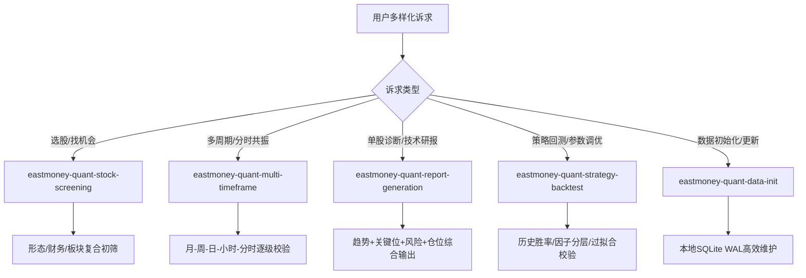

# 东方财富量化投研中心 (Eastmoney Quant Skill Index)

本 Skill 是东方财富量化 MCP 服务的**主路由与投研工作流中枢**。系统提供多周期（月K / 周K / 日K / 60分钟小时K / 分钟分时K）、五大经典上涨形态识别、全市场18维复合选股、板块资金流向以及技术支撑阻力与仓位管理的全套能力。

---

## 投研原则与安全约束

1. **先查状态**: 任何研究前先调用 `get_data_status` 确认本地库状态，数据不足时引导初始化，非当日数据提示更新。
2. **多周期共振**: 遵循 **“月K定大势，周K定方向，日K定形态，小时K定节奏，分时定买卖”** 的多级别联立原则。
3. **形态客观可量化**: 五类上涨形态均基于客观数学规则（极值滞后确认、无未来函数、带标准度评分与共振数），杜绝主观画线。
4. **合规提示**: 所有分析结论均为客观数据呈现与技术推演，必须提示风险与局限性，严禁输出保本、确定性买卖指令。

---

## 14 个核心 MCP 工具全景图

| 分类 | 工具名 | 核心能力与关键参数 |
| :--- | :--- | :--- |
| **数据管理** | `init_full_data` | 首次初始化（`quick=True` 秒级可用；`quick=False` 全量板块） |
| | `update_daily_data` | 收盘后每日增量更新（行情/排名/板块资金） |
| | `get_data_status` | 查看本地数据库行数、最后更新日期与存储路径 |
| **全能选股** | `screen_stocks` | 18维条件组合（PE/PB/市值/换手/量比/涨幅/振幅）+ 板块限定 + 模糊搜 |
| **多周期行情**| `get_kline_local_or_net` | 个股日K（本地优先，自动计算并缓存 20+ 项技术指标） |
| | `get_stock_kline_period`| 多周期K线（`period`: 1/5/15/30/60分钟, 101日, 102周, 103月，纯网络实时） |
| **板块与热度**| `get_rank_trend_data` | 个股近 N 天东方财富/股吧人气排名变化趋势 |
| | `get_sector_list` | 概念/行业板块列表、指数涨跌幅及主力/超大单资金净流入 |
| | `get_stock_belong_sectors` | 反查个股所属板块及概念题材 |
| **技术报告** | `generate_stock_report` | 综合技术报告（趋势/支撑阻力/风险评级/止损止盈/仓位建议） |
| **形态与关键位**| `scan_patterns` | 股票形态扫描（5类形态，`strict=True` 优中选优档，评分与共振） |
| | `scan_sector_patterns` | 板块指数形态扫描（识别率先走出形态的领涨板块） |
| | `get_pattern_history` | 单标的（股票/板块）历史形态触发记录及表现 |
| | `get_key_levels` | 单标的当前关键位（MA均线体系/斐波那契回调位/结构前高前低） |

---

## 用户需求路由与工作流导航

根据用户的不同分析诉求，调度对应的专属子 Skill：

### 典型场景与执行流程：

1. **场景 A：按特定形态找股票（如“帮我找近期走W底或突破平台的股票”）**
   - 调度：`eastmoney-quant-stock-screening` $\rightarrow$ `eastmoney-quant-multi-timeframe`
   - 流程：
     1. 调用 `scan_patterns(patterns=["w_bottom", "box_breakout"], strict=True)` 初筛；
     2. 对筛选出的标的调用 `get_stock_belong_sectors` 检查所属板块资金强度；
     3. 调用 `get_stock_kline_period(period="102")` 验证周K是否处于大周期支撑或上升趋势；
     4. 调取 `get_stock_kline_period(period="60")` 检查小时K是否出现金叉确认点；
     5. 输出候选列表与共振等级。

2. **场景 B：单只股票全面诊断（如“深度分析 600519 贵州茅台的走势与买卖点”）**
   - 调度：`eastmoney-quant-report-generation` $\rightarrow$ `eastmoney-quant-multi-timeframe`
   - 流程：
     1. 调用 `generate_stock_report("600519")` 提取日K趋势、关键支撑阻力与仓位建议；
     2. 调用 `get_key_levels("stocks", "600519")` 计算 MA 系统、斐波那契 0.382/0.5/0.618 与前高前低；
     3. 调用 `get_stock_kline_period("600519", period="103")` 观察月K历史大顶大底位置；
     4. 调用 `get_stock_kline_period("600519", period="102")` 检查周K均线与中期方向；
     5. 调用 `get_stock_kline_period("600519", period="60")` 查看小时K短线回踩结构；
     6. 输出多周期共振深度分析报告。

3. **场景 C：寻找领涨板块及板块内龙头股**
   - 调度：`eastmoney-quant-stock-screening`
   - 流程：
     1. 调用 `get_sector_list(sector_type="concept")` 按主力净流入 `main_net_inflow` 排序找出强势板块；
     2. 调用 `scan_sector_patterns` 查看该板块指数是否处于平台突破或回踩企稳；
     3. 调用 `screen_stocks(sector_code=BKxxxx, sort_by="change_pct")` 调取成分股；
     4. 结合个股形态与人气排名挑选龙头标的。

---

## 五大子 Skill 清单

- [eastmoney-quant-multi-timeframe](file:///c:/Users/20127/Desktop/opensource_project/eastmoney-quant-mcp/src/eastmoney_quant_mcp/skill/multi-timeframe-analysis/SKILL.md)：全周期（月K/周K/日K/小时K/分时）共振研判与交易系统
- [eastmoney-quant-stock-screening](file:///c:/Users/20127/Desktop/opensource_project/eastmoney-quant-mcp/src/eastmoney_quant_mcp/skill/stock-screening/SKILL.md)：多条件与形态驱动的万能选股指南
- [eastmoney-quant-report-generation](file:///c:/Users/20127/Desktop/opensource_project/eastmoney-quant-mcp/src/eastmoney_quant_mcp/skill/report-generation/SKILL.md)：个股全维度技术分析与专业研报生成
- [eastmoney-quant-strategy-backtest](file:///c:/Users/20127/Desktop/opensource_project/eastmoney-quant-mcp/src/eastmoney_quant_mcp/skill/strategy-backtest/SKILL.md)：策略历史回测、参数优化与市场环境适配
- [eastmoney-quant-data-init](file:///c:/Users/20127/Desktop/opensource_project/eastmoney-quant-mcp/src/eastmoney_quant_mcp/skill/data-init/SKILL.md)：本地 SQLite 数据库初次初始化与每日维护
